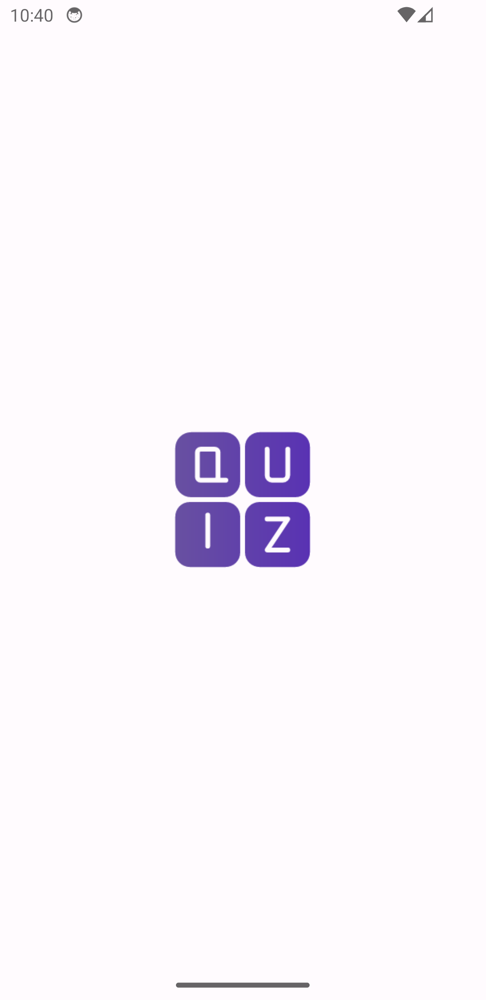
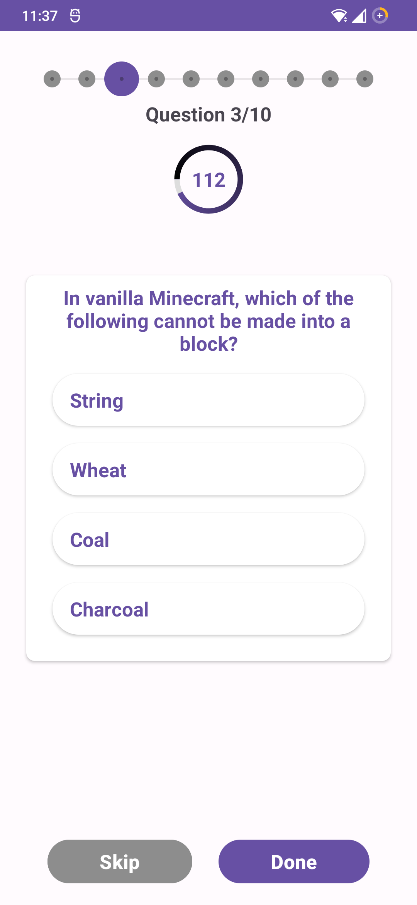
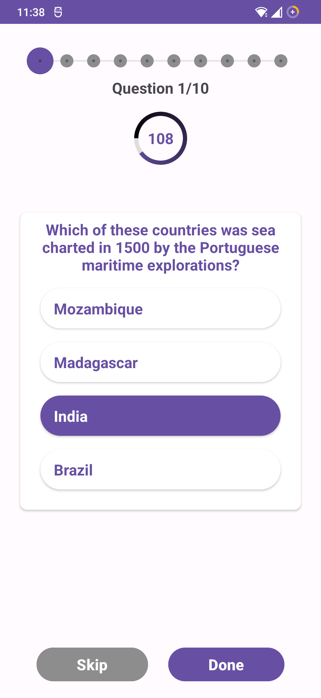
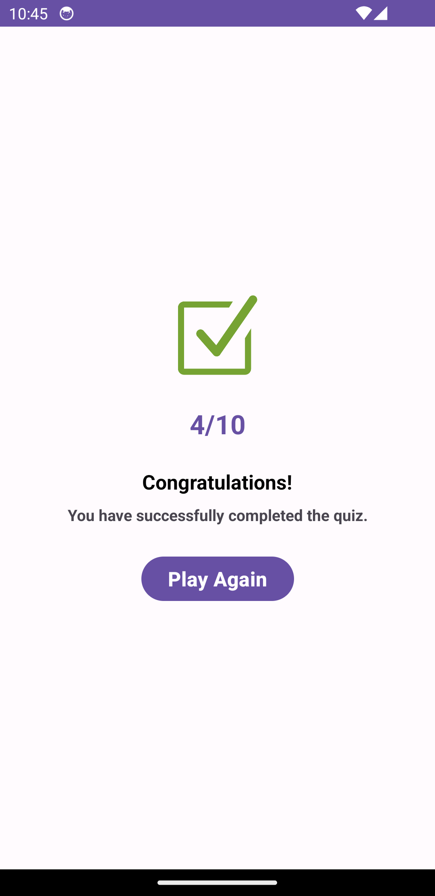

# Android Quiz App
This is a simple Android app that presents the user with ten random quiz questions. The app features a welcome screen with a "Get Started" button, a timer of 2 minutes for each question, and a result screen to display the final score.

## Getting Started
To use this app, follow these steps:

1. Clone the repository to your local machine using Git: <pre> ``` git clone https://github.com/hemnathuprety/quizApp.git ``` </pre>

2. Open the project in Android Studio.

3. Build and run the app on an Android device or emulator.

## Download APK
You can download the APK file of the app using the following link:

[Download APK](https://drive.google.com/file/d/1Ueln9jNekMneNvJFl7jl6iKmhA-3DH6Z/view?usp=sharing)

## Features
### Welcome Screen
When the app is launched, the user is presented with a welcome screen. The screen displays a welcome message and a "Get Started" button. Clicking the "Get Started" button will start the quiz.




### Quiz Questions
Once the user clicks the "Get Started" button, the quiz begins. The app will present ten random questions, one at a time, to the user. Each question is accompanied by multiple choices for the answer.

The user has two minutes to answer each question. A timer is displayed at the top of the screen, counting down the remaining time. If the user fails to answer within the time limit, the question is considered unanswered.




### Result Screen
After the user has completed all ten questions or the time runs out, the quiz ends. The result screen is displayed, showing the user's final score.

The score is calculated based on the number of correct answers out of the ten questions. Additionally, the screen displays the total time taken by the user to complete the quiz.



## Dependencies
The app uses the following dependencies:

[Hilt](https://dagger.dev/hilt/): Hilt is a dependency injection library for Android apps. It simplifies managing dependencies and supports both compile-time and runtime injection.

[Room](https://developer.android.com/training/data-storage/room): Room is an SQLite abstraction for Android, making it easier to work with databases. It provides type-safe queries, object mapping, and caching.

[Retrofit](https://square.github.io/retrofit/): Retrofit is a popular networking library for Android. It simplifies HTTP requests, handling responses, and RESTful API integration.

[RxAndroid](https://github.com/ReactiveX/RxAndroid): RxAndroid brings reactive programming to Android. It handles asynchronous operations and complex data flows using RxJava.

## Contact
If you have any questions or need further assistance, please contact the project maintainer at upretyhemnath@gmail.com.
